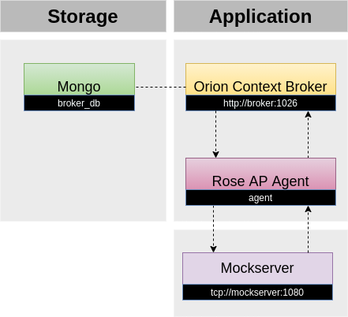

# Step-by-step tutorial

## What is depalletization IoT agent?
The Depalletization IoT Agent for RS232 and MODBUS TCP protocol is both an infrastructural and functional component supporting warehousing and production (de)palletization processes. It provides data about (de)palletization processes performance automated by machines (e.g. approx. time remaining to finish a pile, number of remaining pile layers etc.)

An IoT Agent for RS232 and MODBUS TCP protocol is designed to be a bridge between RS232 ASCII-based custom protocol or MODBUS TCP protocol and the NGSI interface of a context broker.

It is based on the IoT Agent Node.js Library. Further general information about the FIWARE IoT Agents framework, its architecture, and the common interaction model can be found in the library's GitHub repository.

## Requirements
In order to run the Depalletization IoT Agent you need:

* Docker (Version 20.10.0+)
* Docker-compose (Version 1.29.0+)

## Actors
* Mock TCP server acting as a depalletization machine/robot
* Depalletization IoT agent
* Orion Context Broker (with MongoDB database)

## Test scenario 
1. Mock server (virual deplalletization machine) creates a unique palette to be unloaded
2. Mock server (virual deplalletization machine) simulates unloading of a pallet by substracting pile height of a layer thickness every ~15s
3. Mock server (virual deplalletization machine) exposes data through a TCP socket for the IoT depalletization agent 
4. Agent receives raw data from a mock server and calcualtes addtional data (depalletization progress, approx time remaining etc.) 
5. Agent create an NGSI update depalletiozation context message and updates context in the Orion Context Broker
6. When the current pallet is 100% unloaded, the mock server creates new virtual pallet to be unloaded and process repeats from step 2.

## How it works?
> Agent is establishing a TCP connection with mock server.   
> Mock server updates depalletization data every 15s.   
> Mock server is pushing content to the agent through the TCP socket   
> Agent process data received from the mock server 
> Agent updates context data in the Orion Context Broker  

## Step 1. Clone agent repository
Open a terminal and move into a folder in which to create the new folder containing the IoT Agent Testbed,

then run

    git clone "https://github.com/itti-pl/depalletization-agent-rose-ap/"

When repo is cloned, open folder contains it

    cd depalletization-agent-rose-ap

## Step 2. Run the testbed

To launch the whole testbed:

    cd docker-demo
    docker-compose up -d

After that You can run:

    docker ps

To check if all the required components are running.

Running the docker-compose stack (without modifying it) creates the following situation:



## Step 3. Check if Orion Context Broker is working:

To check if Orion Context Broker is working, use the command `curl 127.0.0.1:1026/version` - if You got a response with the version, then all is good.

## Step 4. Initialize context data 
Use command `source context-broker-schema.txt` or manually run curl from file `context-broker-schema.txt` 

This file contains curl with JSON schema for orion context broker

## Step 5. Check logs of the agent and mockserver (sanity tests)
run `docker-compose logs -f`

1. Watch for logs as presented below, to verify that the mock server is up and running:

- Logs below informs about:

  - Data is modified in mock server

  > rose-ap-mockserver  | Modified:  ID PACK=19813.THICK TIM=100.WIDHT TIM=600.WRST=1.HEIGHT PACK=600.  
  > rose-ap-mockserver  |  

  - Data is sent to the agent from mock server 

  > rose-ap-mockserver  | sent: ID PACK=19813.THICK TIM=100.WIDHT TIM=600.WRST=1.HEIGHT PACK=600.  
  > rose-ap-mockserver  | 

2. Watch for logs as presented below to verify that IoT depalletization agent is working. The lines below show that the agent is working.

- Logs below informs about: 
  - data is received from the server and an object is built

  > rose-ap-agent       | data ID PACK=19813.THICK TIM=100.WIDHT TIM=600.WRST=1.HEIGHT PACK=700.  
  > rose-ap-agent       |  2021-06-14T10:00:07.983Z  
  > rose-ap-agent       | dataObject { 'ID PACK': '19813',  
  > rose-ap-agent       |   'THICK TIM': '100',  
  > rose-ap-agent       |   'WIDHT TIM': '600',  
  > rose-ap-agent       |   WRST: '1',  
  > rose-ap-agent       |   'HEIGHT PACK': '700' }  

  - parameters (time per layers, height from each layer, average time per layer) from this carrier 

  > rose-ap-agent       | info.layersTimes [ 20014, 10000, 20011 ] 20011  
  > rose-ap-agent       | info.heights [ 100, 100, 100 ] 2021-06-14T10:00:07.983Z  
  > rose-ap-agent       | averageTime 16 2021-06-14T10:00:07.983Z  
  > rose-ap-agent       | carrierTimeRemaining 1552  

  - update context in broker

  > rose-ap-agent       | dataUpdate: { totalCarrierLayers: { value: 100, type: 'Number' },  
  > rose-ap-agent       |   totalCarrierLayersCompleted: { value: 3, type: 'Number' },  
  > rose-ap-agent       |   carrierLayersProgress: { value: 3, type: 'Number' },  
  > rose-ap-agent       |   carrierTimeRemaining: { value: 25, type: 'Number' } }  

  - executed update in configured Orion Context Broker

  > rose-ap-agent       | 0 Broker update is done 2021-06-14T10:00:07.989Z  

## Step 6. Check for depalletization context data updates in Orion Context Broker:

Use basin NGSI API entities endpoint for checking the currently stored context data. As a result a JSON structure is provided with depalletization performance data of a specific machine – in our example – mocked KUKA robot. Execute curl command to get data from the Orion Context Broker NGSI endpoint:

    curl 127.0.0.1:1026/v2/entities/

Example of the curl command output (NGSI context):


```json
[
  {
    "id": "KUKA:KUKA1",
    "type": "KUKA",
    "active": {
      "type": "Boolean",
      "value": false,
      "metadata": {}
    },
    "carrierId": {
      "type": "Number",
      "value": 19813,
      "metadata": {}
    },
    "carrierLayersProgress": {
      "type": "Number",
      "value": 50,
      "metadata": {}
    },
    "carrierTimeRemaining": {
      "type": "Number",
      "value": 1,
      "metadata": {}
    },
    "lastStateChange": {
      "type": "Number",
      "value": 1606967530617,
      "metadata": {}
    },
    "startPaletteProcessingTime": {
      "type": "Number",
      "value": 1623757568616,
      "metadata": {}
    },
    "totalCarrierLayers": {
      "type": "Number",
      "value": 10,
      "metadata": {}
    },
    "totalCarrierLayersCompleted": {
      "type": "Number",
      "value": 5,
      "metadata": {}
    }
  }
]
```

The context following attributes are available: 

    > CarrierId - currently processed pack/pile/pallet
    > carrierLayersProgress - progress (%) of a currently processed pack/pile/pallet
    > carrierTimeRemaining - time (min) to unplad current pack/pile/pallet 
    > totalCarrierLayers - total nuymber of layers  
    > totalCarrierLayersCompleted - total number of unloaded layers  

Watch for changes in `totalCarrierLayersCompleted` or in `carrierLayersProgress` attributes to observe a simulated deplletization process by executing 
    
    curl 127.0.0.1:1026/v2/entities/
    
    
## What's next?

Once having the data available in the context broker you can use the NGSI API to query data, get notification or consume depalletization data anyhow you want. For example you can use the time remaining attribute to generate notification for forklift operator to provide next palette just in time.  Here, you can see example of the Grafana dashboard for monitoring the depalletization process.


